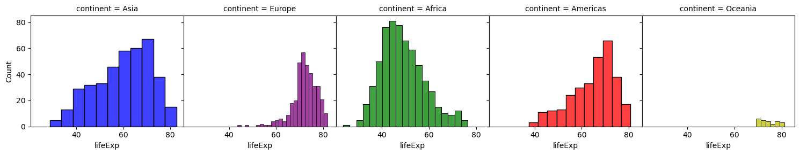
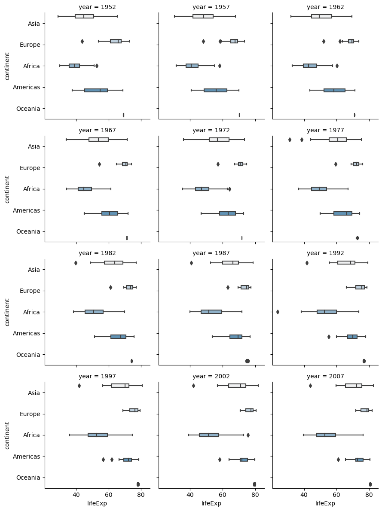
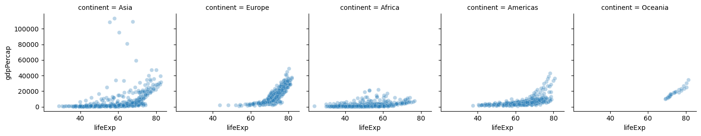
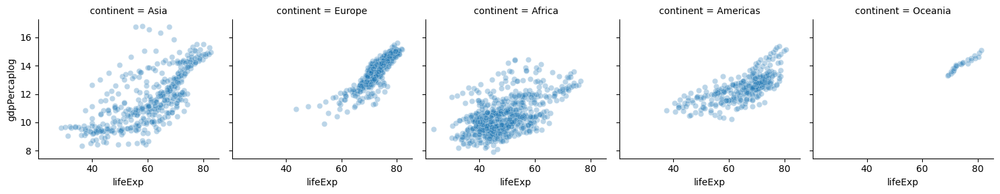
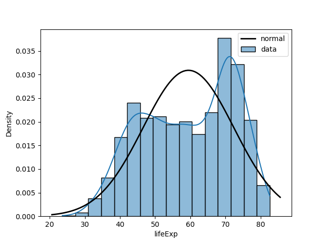

# Homework 1
## Question 1

### Analysis
In this graph I did a stacked barchart of the years to see the count of each continent in life expectancy. As we can see the global life expectancy has increased drastically for all continents. Oceania leads the pack in life expectancy continously and Africa lags behind continously. The biggest shift seems to be in the America's where they have  a pretty even distrubution to start then go towards the front globally.
## Question 2

### Analysis
As we can see the life expentancy varies drastically by contintent. With some continents having a wider distrubution. I find it particularly interesting the imporvment made in Aisa especially from 1972-1987. This can be an effect of globalization and stabalitity in the region. Africa has also seen a notable increase in the middle quartile showing a difference betwwen developing African nations and more traditional nations. 
## Question 3


### Analysis
Before the log base it is hard to see any trend in the data. After the log base it is clear to see the linear relationship between gdp per capita and life expentancy in each country in each continent.
This trend is more ambigous for Africa and for Aisa and slightly Europe it can be argued the relation is more quadratic. 
## Question 4

### Analysis
In this we see that life expectancy does not fit the normal curve rather looking like a saddle with a high density around 40 and higher densisty around 70. This is kind of to be expected as we have shown the positive realtionship between gdp per capita and expected life expectency and expected gdp is not uniformally distrubuted. So it is expected there will be a higher expected life for those who participate in the global economy and those who don't. So lobe 1 is those countries who are more sheltered in the gloabl economy with lower income and the other lobe is those with higher income. So the income gap between countries is the reason why we see those two gaps.
## Reproduce
### Data
data is from https://github.com/jennybc/gapminder/blob/main/inst/extdata/gapminder.tsv and can be imported using the command 
```
make data
```
### Figures
you can reproduce the figures by doing a make command followed by fig#. An Example to produce figure 1
```
make fig1
```
This must be done after make data and making the repo clean
### Clean
to clean type
```
make clean
```
