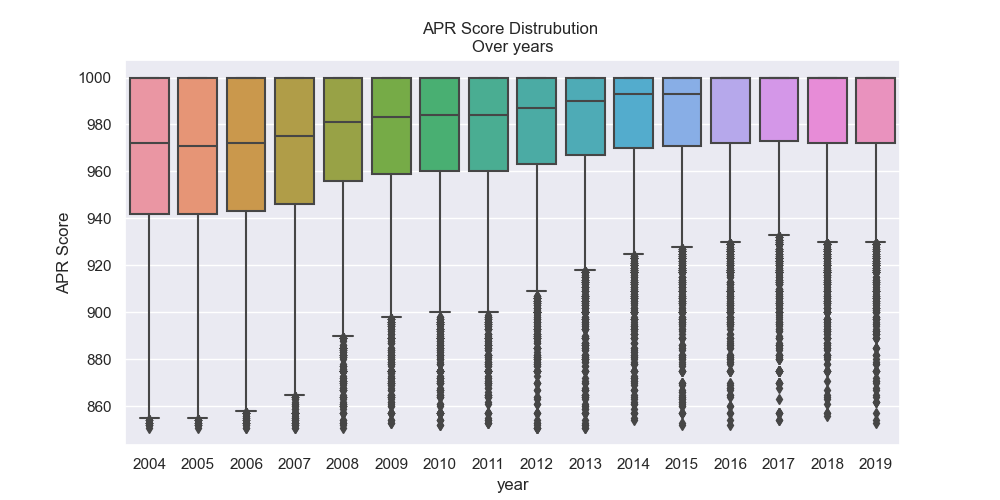
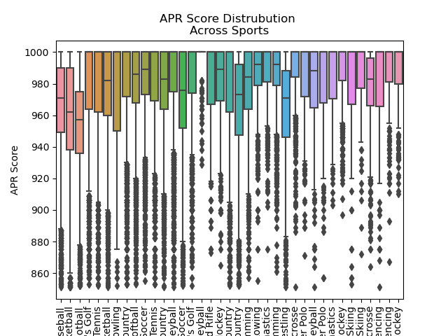

# Homework 2
## Question 0

So when cleaning the data I noticed it was very skewed so I thought this would hamper the interpretation of the data so I made the datafram equal to 850. I choose this number by creating a boxplot and while asking it to take out the outliers and getting the xlim which produced a result of 898. Then I went down to get as much data as possible while keeping the distrubution visualizations clear. 
## Question 1

### Analysis
In this graph I created a facet grid based on year with an overlay of violin plots and boxplots to visulaze the distrubution. We can see from both elements that overtime the APR score for all college sports has gone up by around 25 points. And we see from 2016 to 2019 more then half the data reciving scores of 1000.
## Question 2

### Analysis
This is another violin plot by this is split and hued on male to female sports. We can see form this graph that female sports have had a higher average APR score then male sports for all years. Female sports distrubution seesm to consistently be near 1000 especially in the 2010's. Male sports had a wider distrubution to start with an example being 2004 where male sport distrubution was almost uniform from APR Scores of 925-1000. But Men distrubutions have become more homogenous, congealing around 1000.
## Question 3

### Analysis
This last graph is a facetgraph of histograms of each sports APR scores. It seems the higher the economic oppurtunity of the sport the lower the more normal the distrubution. We see this is the case in football,men's  basketball, baseball and men's soccer. These sports are usually higher grossing and provide more economic oppurtuinty for the players if they choose to go pro which can in turn affect graudation rates which can be a reason why we see the APR score go down. These sports also allow student athletes to be drafted without receiving a degree hence the more uniform or normal distrubution. We also see sports with tradioally longer seasons doing worse such as mens and womens basketball compared to mens and womens golf or women;s sand volleyball. In these distrubutions I also added the mean for women's sports and men's sports and we see men's sports are less right skewed then women's sports for the most part with about 100 point difference in mean APR scores. This can once again be aided by the economic oppurtunity afforded to male athletes instead of femal athletes.
