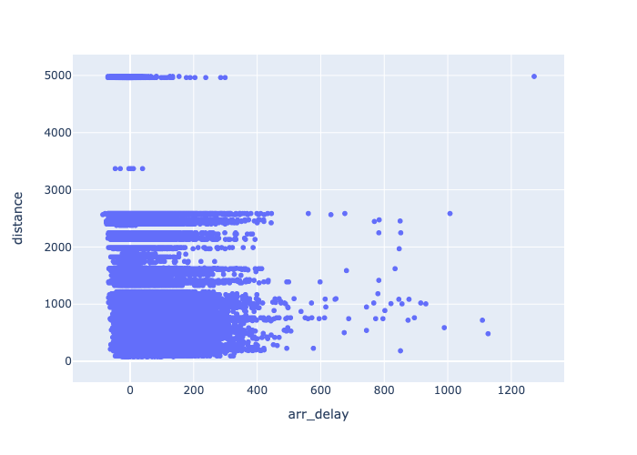
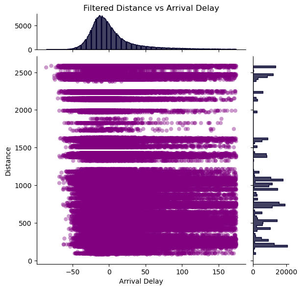
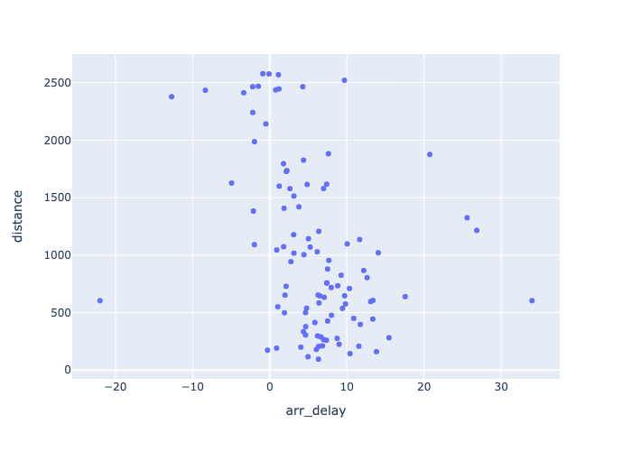

# hw-flights

## Goals:

* EDA with flights dataset
* Experience with SQLite
* Complex SQL queries

## Data

The [nycflights13](https://github.com/tidyverse/nycflights13) database is available in the
[rdata](https://github.com/ds5110/rdata/tree/main/data) repo both as a collection of CSV files 
and as a SQLite database: "mydb.sqlite".

## Story

Can you identify a robust relationship between arrival delay and distance in the nycflights13 dataset?

## Assignment

### Question 1

If you visualize the scatterplot of `arr_delay` and `distance` in the flights table, 
you'll notice a couple `distance` outliers.
Explain the source of these outliers, and remove them from the flights table. 
Then plot distance vs arr_delay using 
a [seaborn joint histogram](https://seaborn.pydata.org/examples/joint_histogram.html).
After filtering, describe the most interesting features relevant to the "story".
Keep your description to one or two sentences.


I find it intersting that distance is not a normal distrubution but this makes sense as there are only a certain amount of cities with constant flights. It is also important to show that there is a normal distrbution with flight delay time.
The Outliers are very large and most likely due to weather differences between the two places causing major delays in flights.


### Question 2

Recall the central limit theorem, where the averaging of random data with arbitrary distributions
tends to reduce variance and create normally distributed averages.
Group the flights data by destination and average them. 
Produce a scatterplot that more clearly visualizes
a potential relationship between `arr_delay` and `distance.` 
Briefly explain your conclusion.

I don't think there is a major realtionship but there seems to be a somewhat inverse realtionship between arrival delay and distance. This makes sense as there is more air time to make up for the delay.
### Question 3

The following figure is from [Chapter 13 of R for Data Science](https://r4ds.had.co.nz/relational-data.html) 
by Hadley Whickam.


Given that the primary key for a table in a RDBMS must be unique and that you can use multiple fields as a key,
can the grayed fields in the flights table be used as a primary key for the flights table?
Write a short python program that reads flights.csv to demonstrate your answer.
```
id can be used as index
```
### Question 4

Get a copy of the SQLite database in the rdata directory for the course.
Write two SQL queries -- one using a JOIN and the other using WHERE -- to produce the following:

* print the carrier, tail number, month and day for each flight
* order the results by these fields (in the order specified)
* get only those flights for which the plane is a made by "AIRBUS INDUSTRIE"
* get only the first 10 flights

The two queries should produce the same results. For your solution...
```
SELECT carrier,tailnum,month,day FROM flights ORDER BY carrier,tailnum,month,day
```
```
       carrier tailnum  month  day
0           9E    None      1    4
1           9E    None      1    4
2           9E    None      1    5
3           9E    None      1    7
4           9E    None      1    9
...        ...     ...    ...  ...
336771      YV  N942LR     12   16
336772      YV  N956LR      7   29
336773      YV  N956LR      9    2
336774      YV  N956LR      9   11
336775      YV  N956LR     10    9
```
```
SELECT flights.carrier,flights.tailnum,flights.month,flights.day,planes.manufacturer FROM flights INNER JOIN planes ON planes.tailnum=flights.tailnum WHERE planes.manufacturer='AIRBUS INDUSTRIE'
```
```
  carrier tailnum  month  day      manufacturer
0      B6  N516JB      1    1  AIRBUS INDUSTRIE
1      DL  N326NB      1    1  AIRBUS INDUSTRIE
2      UA  N459UA      1    1  AIRBUS INDUSTRIE
3      US  N807AW      1    1  AIRBUS INDUSTRIE
4      US  N178US      1    1  AIRBUS INDUSTRIE
5      DL  N327NW      1    1  AIRBUS INDUSTRIE
6      DL  N318NB      1    1  AIRBUS INDUSTRIE
7      UA  N838UA      1    1  AIRBUS INDUSTRIE
8      UA  N841UA      1    1  AIRBUS INDUSTRIE
9      UA  N488UA      1    1  AIRBUS INDUSTRIE
```

* Include the two queries in this README.md (using markdown for code).
* Include the results of the two queries in your README.md (also using markdown for code).

