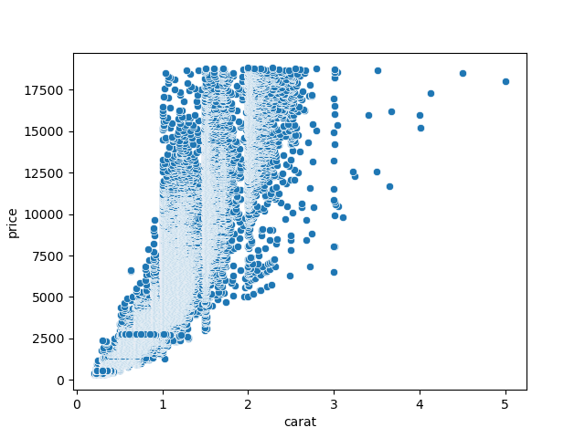
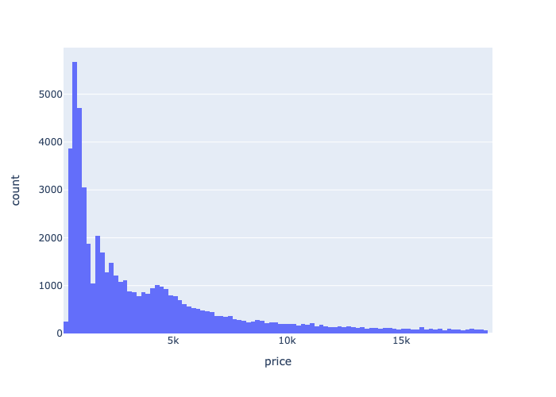
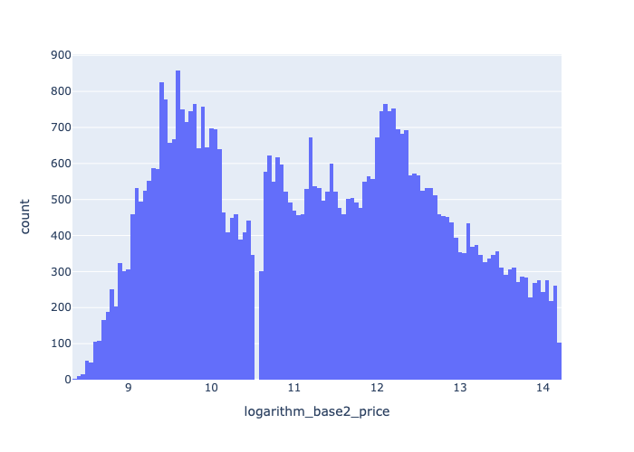
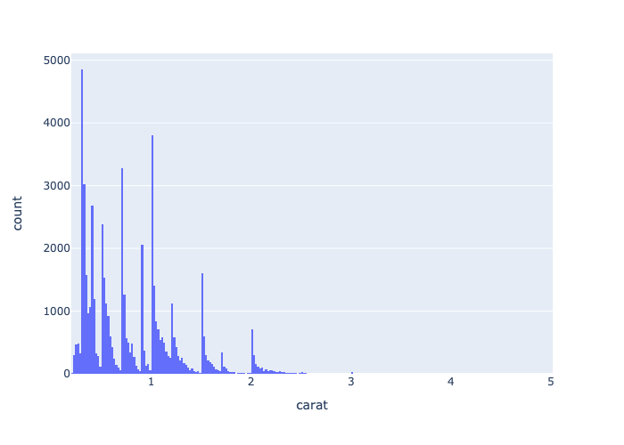
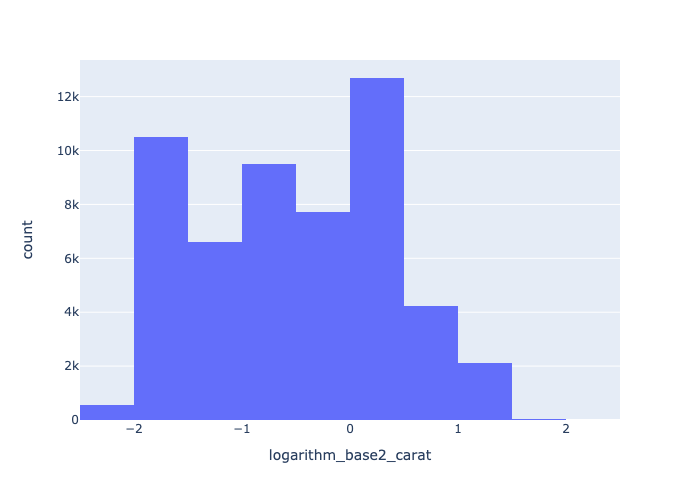
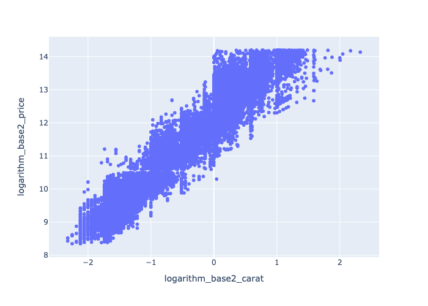
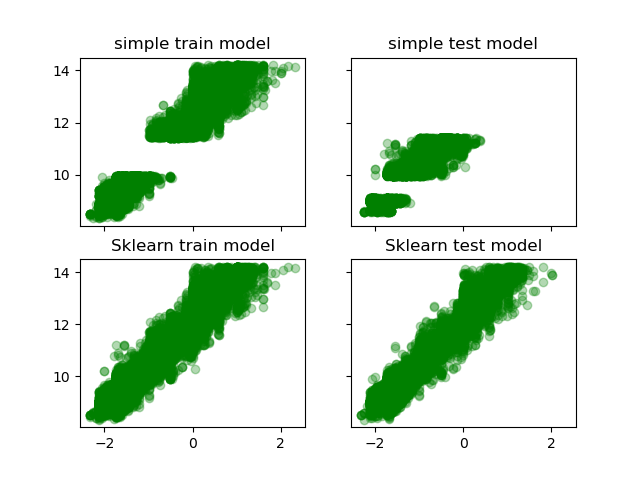

# hw-diamonds
## Assignment

data gotten from [ggplot2 github repo](https://github.com/tidyverse/ggplot2/).

## Question 1

Visualize the relationship between "price" and "carat" and comment on the type of model that 
might be appropriate for modeling their relationship.
To get this anwser type
```
make q1
```

This shows an exponential relationship between price and carat

## Question 2

Investigate logarithmic transformations to see if you can find a more appropriate relationship
between "price" and "carat" for univariate linear regression.
Use data visualization to help justify your choice of model.
Use explained variance score as a metric for model performance, and report training scores based on the entire dataset.
To get this anwser type
```
make q2
```

This shows the distrubution of Price before log transformation

This shows the distrubution of Price after log transformation

This shows the distrubution of Carat before log transformation

This shows the distrubution of Carat after log transformation

This shows the relationship after both log transformations. It has a much more linear pattern
## Question 3

Use the `simple_train_test_split` function below and `sklearn.model_selection.train_test_split` 
to evaluate the explained variance of the univariate model using the testing dataset.
Use explained variance as a metric for model performance.
Describe the results and create a visualization that helps explain the differences between the two approaches.
```
def simple_train_test_split(X, y, test_size=.3):
    n_training_samples = int((1.0 - test_size) * X.shape[0])

    X_train = X[:n_training_samples,:]
    y_train = y[:n_training_samples]

    X_test = X[n_training_samples:,:]
    y_test = y[n_training_samples:]

    return X_train, X_test, y_train, y_test
```
The explained varience results are 
```
the simple models explained varience is 0.7178769798196512
```
for the simple model and
```
the sklearn model explained varience is 0.9330899637942405
```
and above for the sklearn model
This difference is because of the the different samples with simple train test function being a more biased sample as seen in the figure below

## Question 4

Use one-hot encoding to find the best 2-input model by adding either "cut", "color" or "clarity" as a second predictor along with "log(carat)" to model "log(price)". Which 2-input model has the best performance? Report the training score
with explained variance metric, using the entire dataset for both training and evaluation. Compare to the corresponding univariate model in question 2. What's the ".shape" of the feature matrix for the "best" model?
the training scores are:
```
the accurary of color is 0.9454371002032458
the accurary of clarity is 0.9650131177167282
the accurary of cut is 0.9364267365720909
```
the shape of the feature matrix is
```
The shape of clarity is (53940, 8)
```

## Question 5

Repeat the analysis of Question 4, this time using 5-fold cross validation.
Report both train and test scores (average +/- standard deviation).
Compare results here with those of Question 4.
Discuss results and explain any significant differences with Question 4.
the training scores are:
```
the accurary of one of the test for color is 0.8653088560846373
the accurary of one of the test for color is 0.8928812140358715
the accurary of one of the test for color is 0.9618523844081679
the accurary of one of the test for color is 0.09024395564197507
the accurary of one of the test for color is 0.7804017213085085
the accurary of one of the test for clarity is 0.9222465286780348
the accurary of one of the test for clarity is 0.9264137875493017
the accurary of one of the test for clarity is 0.9785227750823026
the accurary of one of the test for clarity is 0.4923038751575213
the accurary of one of the test for clarity is 0.8548443500295189
the accurary of one of the test for cut is 0.8598152918344492
the accurary of one of the test for cut is 0.8646840003775891
the accurary of one of the test for cut is 0.9558570115816631
the accurary of one of the test for cut is 0.042695226588763124
the accurary of one of the test for cut is 0.7598971409198919
```
These results much lower then question 4 with a larger difference between 
