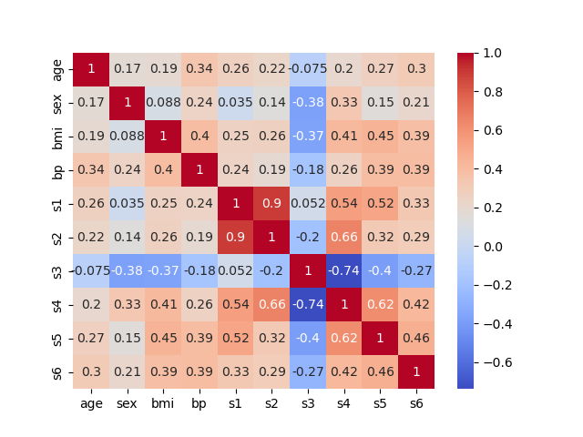

# hw-diabetes


## Goals

* Model-selection techniques using the diabetes dataset
* Comparison of feature ranking with $R^2$, forward selection and Lasso
* PCR (principal component regression) with cross validation to assess feature dimension

## Assignment

Use the diabetes dataset from [sklearn.datasets.load_diabetes](https://scikit-learn.org/stable/modules/generated/sklearn.datasets.load_diabetes.html) to answer the questions below.

## Question 1
```
make q1
```

Rank the features according to their squared correlation with the target. 
Note that squared correlation is the same as $R^2$ for univariate regression. 
Visualize the ordered scores with a bar chart.

## Question 2
```
make q2
```

Rank the features according to the order that they're added in the [forward sequential feature selection](https://scikit-learn.org/stable/modules/generated/sklearn.feature_selection.SequentialFeatureSelector.html) algorithm. Use this ranking to reorder the bar chart in question 1.

## Question 3
```
make q3
```

Compare the bar charts in Questions 1 & 2.
Briefly discuss differences between the two charts and possible causes.
Add a figure to prove your point.

## Question 4
```
make q4
```

Plot cross-validation scores versus the number of components used in Principal Component Regression (PCR). 
(Recall the [PCR vs PLS](https://scikit-learn.org/stable/auto_examples/cross_decomposition/plot_pcr_vs_pls.html)
demo mentioned in class.)
Include both training and test scores.
Comment on the dimensionality of the dataset and the degree of overfitting.
Hint: The [CV-diabetes demo](https://scikit-learn.org/stable/auto_examples/exercises/plot_cv_diabetes.html),
which uses cross-validation to determine the best `alpha`, may be helpful in answering this question.

## Question 5
```
make q5
```

The [lasso lars demo](https://scikit-learn.org/stable/auto_examples/linear_model/plot_lasso_lars.html) computes and plots the coefficients with lasso. Add a legend to the plot so that you can relate colors to feature names. Briefly compare the lasso ordering to your answers above.
# hw-diabetes
## Results

data gotten from sklearn database diabetes.

## Question 1

## Question 2

## Question 3
Well in question 1 we sorted the values based on r2 value and in the second we did sequential feature selection. The differences are fairly evident as BMI is the first selection although s5 has the higher R2 value. We also see age variable drastically increasing and s4 and s6 both dramatically go down in the order. This can be because of multicollinearity between variables so what is explained by one variable is explained by the other. The correlation between these variables is shown in the heatmap below.

## Question 4

For this problem I commited 30% of the dataset to testing and 70% to training. We see in this graph that both the training and testing increase in r2 up to 4 components then afterwards we see overfitting as the training dataset gets slightly more accurate while the testing data goes down in r2. 
## Question 5

We see that this graph relates well to figure 2 as we see bmi,s5, bp and s3 being close to alpha of 0. We then see the other variables go down the alpha after this which makes sense with our pc analysis.
