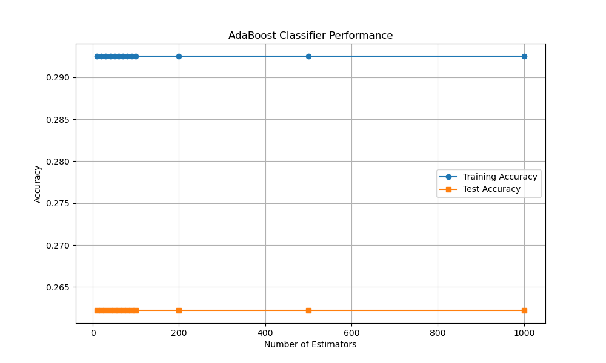

# hw-digits

## Learning goals

* dealing with unbalanced data
* hyperparameter selection with validation curves & cross validation
* comparing DecisionTreeClassifier, RandomForestClassifier, AdaBoost & SVC

## Instructions

This assignment builds on
[05.02 - Introducing Scikit-Learn](https://github.com/jakevdp/PythonDataScienceHandbook/blob/master/notebooks/05.02-Introducing-Scikit-Learn.ipynb) by VanderPlas, which produces train/test accuracy of 0.86/0.83 for Gaussian Naive Bayes
classification of the digits dataset.
You can reproduce those results with
```
make template
```
which prints the train/test accuracy:
```
Train accuracy: 0.86
Test accuracy: 0.83
```
and plots the confusion matrix:


## Question 1

Use the [classification_report](https://scikit-learn.org/stable/modules/generated/sklearn.metrics.classification_report.html) to investigate performance by class.
Describe the source of variation in the "support" column.
Is the variation problematic? Justify your assessment quantitatively.
Explain your conclusions in a maximum of 1 or 2 sentences maximum.
```
make template
```
```
Classification Report:
               precision    recall  f1-score   support

           0       1.00      1.00      1.00        37
           1       0.70      0.91      0.79        43
           2       0.95      0.45      0.62        44
           3       0.83      0.87      0.85        45
           4       0.94      0.82      0.87        38
           5       0.98      0.90      0.93        48
           6       1.00      0.98      0.99        52
           7       0.76      0.98      0.85        48
           8       0.55      0.79      0.65        48
           9       1.00      0.64      0.78        47

    accuracy                           0.83       450
   macro avg       0.87      0.83      0.83       450
weighted avg       0.87      0.83      0.83       450
```
The variation in support is because we randomly select a test set so that does not always mean an even distrubution of numbers. No the variation is not problematic as if we take the mean number of support 45 and get SE of our sample which is 4.7 all of our samples are with 2 SE of the mean.
## Question 2
```
make q2
```
Use a decision tree classifier with the same data.
Investigate model performance with a validation curve.
Comment briefly (1 or 2 sentences, maximum) on the results, including a comparison with the results from Question 1.

We see here that as our tree depth goes up our training and test scores go up plateauing around 10 tree nodes. We can see from the validation curve our f1-score achievied in question 1 is realtively high because above average throughout the model and only within the standard range after 7 features.
## Question 3
```
make q3
```
In [5.08 Random Forests](https://github.com/jakevdp/PythonDataScienceHandbook/blob/master/notebooks/05.08-Random-Forests.ipynb), VanderPlas performs digits classification with a random forest.
He uses `n_estimators=1000`.
Use a validation curve to investigate the choice of n_estimators.
Comment briefly on the results (including comparison with results above).

This one I actually did multiple graphs first starting from a range of 800 to 1000 but it looked like a fairly straight line then from 0-1000 still fairly straight so I focused in on the 0-100 range going up by 5 features we see a jump from 5 to 10 features and this jump continues from 10-20 but plateaus after 20 much less then VanderPlas's 1000. This is more estimators then in question 2 but we do achieve a higher accurary score then either question 1 or 2.
## Question 4
```
make q4
```
Investigate use of
[AdaBoost](https://scikit-learn.org/stable/modules/generated/sklearn.ensemble.AdaBoostClassifier.html).
Boosting is discussed in Section 8.2.2 (p345) of ISLR.
Look at the scikit-learn
[adaboost example](https://scikit-learn.org/stable/auto_examples/ensemble/plot_adaboost_hastie_10_2.html) for ideas.
Comment briefly on results and your choice of hyperparameters (including comparison with results above).

The adaboost does not change very much regarding the number of parameters. It is consistently around 0.3 for training and 0.26 for testing. I chose hyperparameters of 10-100 by 10's and then 200,500 and 1000 because orginally I didn't see much difference within 100 and wanted to see more closer to VanderPlas's estimator. And with the extended range it continues to plateau. 
## Question 5
```
make q5
```
Adapt the use of SVC in cells 18-26 of
[Labeled Faces in the Wild demo in VanderPlas](https://github.com/jakevdp/PythonDataScienceHandbook/blob/master/notebooks/05.07-Support-Vector-Machines.ipynb).
When selecting optimal hyperparameters, make sure that your range encompasses the
best value.
Comment briefly on results and your choice of hyperparameters (including comparison with results above).
```
Optimal Hyperparameters: {'C': 10, 'gamma': 0.001}
```
```
              precision    recall  f1-score   support

           0       1.00      1.00      1.00        53
           1       1.00      1.00      1.00        50
           2       1.00      1.00      1.00        47
           3       0.98      0.96      0.97        54
           4       1.00      1.00      1.00        60
           5       0.99      1.00      0.99        66
           6       1.00      1.00      1.00        53
           7       0.98      0.98      0.98        55
           8       0.98      1.00      0.99        43
           9       0.98      0.97      0.97        59

    accuracy                           0.99       540
   macro avg       0.99      0.99      0.99       540
weighted avg       0.99      0.99      0.99       540
```

Using gridsearch we find that that 10 nodes and a gamma of 0.001 are the best options. This is similar to above as the number of nodes levels out at around 10. But we see very high f1-scores and a very good confusion matrix with our hyperparameters.
